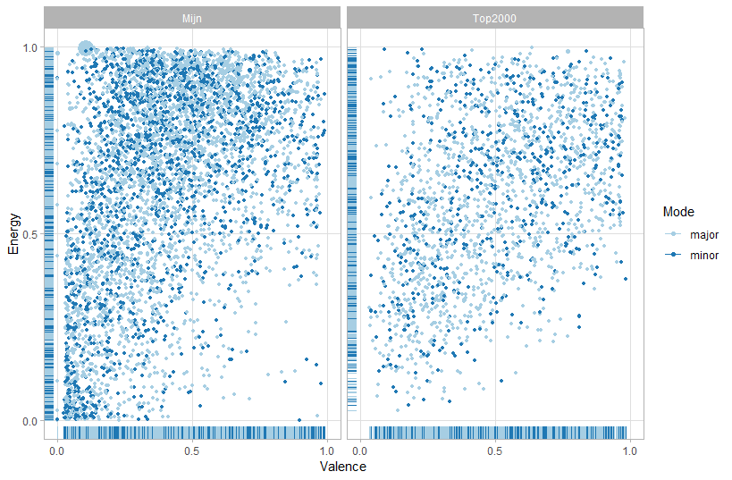
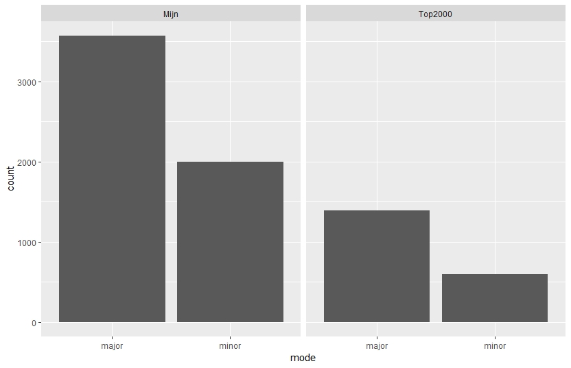

# Portfolio by Mariëlle Baelemans
## Week 6: Music Information Retrieval * Spotify API 

For my portfolio project I want to use the findings out of an earlier Musicology project. In my research on what makes music 'sad' I found that the minor aspect is the thing what makes music sad. Besides that aspect, also slowness and low pitch are important for giving a listener a sad feeling. My big goal for this portfolio project is to make a widget that measures how sad someone's playlist is by comparing these factors in a 3:2:1 ratio. With these outcomes I want to make a day by day scheme for how 'sad' your day was according to the songs you listened that day. A calendar that shows your mood based on the music you listen ;). 
For now this is a too big goal, so my first step is to compare the major/minor- ratio and the mean tempo of my own playlist 'Most listened 2018' to 'Top 50 Nederland' playlist.  I have not found a way yet to measure the pitch of the songs in the playlists, so for now I use the 'loudness' as extra indicator. 

So far it seems that my own playlist is less sad than the Top 50 Nederland. 
Minor is 31% against 40% in Top 50 Nederland.
My mean tempo is 120 BPM (sd= 31.7) against 116 BPM (sd= 24,0) 
For loudness the outcome for my most listened 2018 has a mean of -8,06 ; sd= 3,55. For Top50NL it has a mean of -6,64  with sd= 2,84.

I can make a formule to calculate the sadness (because of the different in numbers this formulate is not really accurate, but it is a sketch for futher steps).

Sadness= 3mode -2(tempo/1000) -loudness/10. 

Sadness(Top50NL)= 3x0,40 - 2x0,116 + 0,664 = 1.632

Sadness(My2018)= 3x0,31 - 2x0,120 + 0,806 = 1.976

My goal is to create a formule that which takes these aspects in a 3:2:1 ratio and is based on a 1 to 100 scale. 

Imported to keep in mind for the next weeks is that aspects as tempo and loudness are not well measured for songs with long silent intros, like You- The 1975. Those kind of songs are better left behind. While googling for these statistics I found out that Spotify has a correctness chance, this is something to use in the next weeks. 

I would also prefer to use Last.fm for my statistics, because I spend a big amount of my music listening on YouTube. 

## Week 7 Data Visualisation
First of all, I decided to change the playlist I'm comparing. I have a playlist where I put in all the music I listen to. This playlist consist of almost 6,000 songs. I compare this playlist with the 'Top2000' of the Netherlands (of 2018, I made my own playlist also in 2018). Good to notice is that my own playlist (called 'mijn') is 3x as big as the Top2000. 
As dr. Burgoyne told in the lecture, for this research I will use: mode, energy and valence. Luckily for me, dr. Burgoyne already made a really good visualisation using these factors, so the only thing I had to do was chancing the visualisation to my own playlists. 

 ### Here are the visualisations.
 
 
 
 ### Some codings I need to remember for myself
Mood %>%                       # Start with awards.
  ggplot(                      # Set up the plot.
    aes(
      x = valence,
      y = energy,
      size = loudness,
      colour = mode
    )
  ) +
  geom_point() +               # Scatter plot.
  geom_rug(size = 0.1) +       # Add 'fringes' to show data distribution.
  facet_wrap(~ playlist) +     # Separate charts per playlist.
  scale_x_continuous(          # Fine-tune the x axis.
    limits = c(0, 1),
    breaks = c(0, 0.50, 1),  # Use grid-lines for quadrants only.
    minor_breaks = NULL      # Remove 'minor' grid-lines.
  ) +
  scale_y_continuous(          # Fine-tune the y axis in the same way.
    limits = c(0, 1),
    breaks = c(0, 0.50, 1),
    minor_breaks = NULL
  ) +
  scale_colour_brewer(         # Use the Color Brewer to choose a palette.
    type = "qual",           # Qualitative set.
    palette = "Paired"       # Name of the palette is 'Paired'.
  ) +
  scale_size_continuous(       # Fine-tune the sizes of each point.
    trans = "exp",           # Use an exp transformation to emphasise loud.
    guide = "none"           # Remove the legend for size.
  ) +
  theme_light() +              # Use a simpler them.
  labs(                        # Make the titles nice.
    x = "Valence",
    y = "Energy",
    colour = "Mode"
  )
