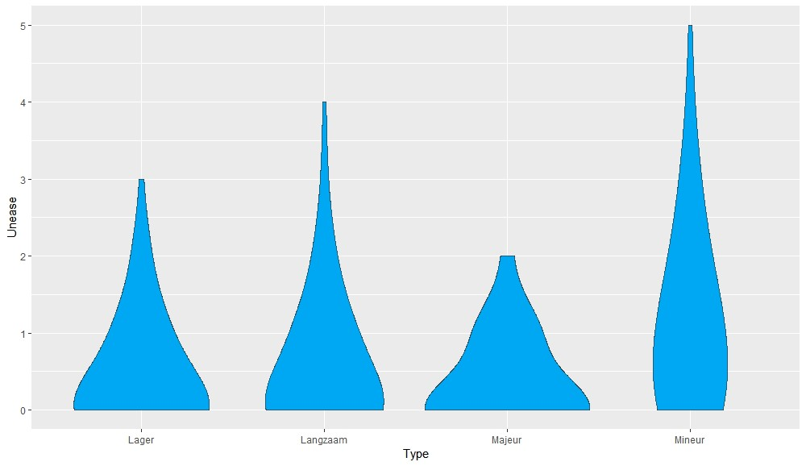
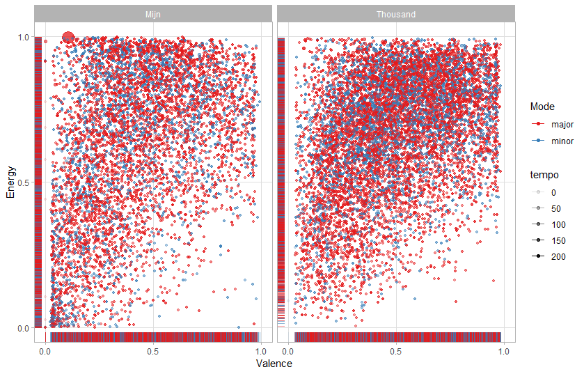

```{r}
# In order to use these packages, we need to install flexdashboard, plotly, and Cairo.
library(tidyverse)
library(plotly)
library(spotifyr)
source('spotify.R')

#----- SPOTIFY CREDENTIAL FOR SPOTIFYR -----#

if (Sys.getenv('SPOTIFY_CLIENT_ID') == '')
    Sys.setenv(SPOTIFY_CLIENT_ID = 'e944328ebc754d5dae4607ba0b9b7aa0')
if (Sys.getenv('SPOTIFY_CLIENT_SECRET') == '')
    Sys.setenv(SPOTIFY_CLIENT_SECRET = '32c46cc6766a44dfb68e24f7a1aae5b6')

#----- AUDIO ANALYSIS FUNCTIONS -----#

#' Get Spotify audio analysis tidily.
#'
#' Loads the Spotify audio analysis for a track without extra
get_tidy_audio_analysis <- function(track_uri, ...)
{
    get_track_audio_analysis(track_uri, ...) %>%
        list %>% transpose %>% as_tibble %>%
        mutate_at(vars(meta, track), . %>% map(as_tibble)) %>%
        unnest(meta, track) %>%
        select(
            analyzer_version,
            duration,
            contains('fade'),
            ends_with('confidence'),
            bars:segments) %>%
        mutate_at(
            vars(bars, beats, tatums, sections),
            . %>% map(bind_rows)) %>%
        mutate(
            segments =
                map(
                    segments,
                    . %>%
                        transpose %>% as_tibble %>%
                        unnest(.preserve = c(pitches, timbre)) %>%
                        mutate(
                            pitches =
                                map(
                                    pitches,
                                    . %>%
                                        flatten_dbl %>%
                                        set_names(
                                            c(
                                                'C', 'C#|Db', 'D', 'D#|Eb',
                                                'E', 'F', 'F#|Gb', 'G',
                                                'G#|Ab', 'A', 'A#|Bb', 'B'))),
                            timbre =
                                map(
                                    timbre,
                                    . %>%
                                        flatten_dbl %>%
                                        set_names(
                                            c(
                                                'c01', 'c02', 'c03', 'c04',
                                                'c05', 'c06', 'c07', 'c08',
                                                'c09', 'c10', 'c11', 'c12'))))))
}

#----- NORMS AND DISTANCE FUNCTIONS -----#

#' Normalise vectors for Computational Musicology.
#'
#' We use a number of normalisation strategies in Computational Musicology.
#' This function brings them together into one place, along with common
#' alternative names.
compmus_normalise <- compmus_normalize <- function(v, method = 'euclidean')
{
    ## Supported functions

    harmonic  <- function(v) v * sum(1 / abs(v))
    manhattan <- function(v) v / sum(abs(v))
    euclidean <- function(v) v / sqrt(sum(v^2))
    chebyshev <- function(v) v / max(abs(v))
    clr       <- function(v) {lv <- log(v); lv - mean(lv)}

    ## Method aliases

    METHODS <-
        list(
            identity  = identity,
            id        = identity,
            harmonic  = harmonic,
            manhattan = manhattan,
            L1        = manhattan,
            euclidean = euclidean,
            L2        = euclidean,
            chebyshev = chebyshev,
            maximum   = chebyshev,
            aitchison = clr,
            clr       = clr)

    ## Function selection

    if (!is.na(i <- pmatch(method, names(METHODS))))
        METHODS[[i]](v)
    else
        stop('The method name is ambiguous or the method is unsupported.')
}

#' Compute pairwise distances for Computational Musicology in long format.
#'
#' We use a number of distance measures in Computational Musicology.
#' This function brings them together into one place, along with common
#' alternative names. It is designed for convenience, not speed.
compmus_long_distance <- function(xdat, ydat, feature, method = 'euclidean')
{

    feature <- enquo(feature)

    ## Supported functions

    manhattan <- function(x, y) sum(abs(x - y))
    euclidean <- function(x, y) sqrt(sum((x - y) ^ 2))
    chebyshev <- function(x, y) max(abs(x - y))
    pearson   <- function(x, y) 1 - cor(x, y)
    cosine    <- function(x, y)
    {
        1 - sum(compmus_normalise(x, 'euc') * compmus_normalise(y, 'euc'))
    }
    angular   <- function(x, y) 2 * acos(1 - cosine(x, y)) / pi
    aitchison <- function(x, y)
    {
        euclidean(compmus_normalise(x, 'clr'), compmus_normalise(y, 'clr'))
    }

    ## Method aliases

    METHODS <-
        list(
            manhattan   = manhattan,
            cityblock   = manhattan,
            taxicab     = manhattan,
            L1          = manhattan,
            totvar      = manhattan,
            euclidean   = euclidean,
            L2          = euclidean,
            chebyshev   = chebyshev,
            maximum     = chebyshev,
            pearson     = pearson,
            correlation = pearson,
            cosine      = cosine,
            angular     = angular,
            aitchison   = aitchison)

    ## Function selection

    if (!is.na(i <- pmatch(method, names(METHODS))))
        bind_cols(
            crossing(
                xdat %>% select(xstart = start, xduration = duration),
                ydat %>% select(ystart = start, yduration = duration)),
            xdat %>% select(x = !!feature) %>%
                crossing(ydat %>% select(y = !!feature)) %>%
                transmute(d = map2_dbl(x, y, METHODS[[i]])))
    else
        stop('The method name is ambiguous or the method is unsupported.')
}


compmus_self_similarity <- function(dat, feature, method = 'euclidean')
{
    feature <- enquo(feature)
    compmus_long_distance(dat, dat, !!feature, method)
}


#----- SUMMARIES -----#

#' Summarise vector-based features in list columns.
#'
#' Summarise vector-based featrues in list columns. Does not work with classical tidyverse grouping.
compmus_summarise <- compmus_summarize <- function(dat, feature, method = 'mean', norm = 'id')
{
    feature <- enquo(feature)

    ## Support functions
    ## TODO: Add geometric median and Chebyshev center.
    ## TODO: Search for minimum sum of angular distances in hyper-quadrant I.

    clr     <- function(v) {lv = log(v); lv - mean(lv)}
    softmax <- function(v) {exp(v) / sum(exp(v))}
    square  <- function(v) v^2
    not_max  <- function(v) v != max(v)

    ## Method aliases

    METHODS <-
        list(
            ## Central tendencies
            mean      = list( identity , mean , identity ),
            aitchison = list( clr      , mean , softmax  ),
            acenter   = list( clr      , mean , softmax  ),
            acentre   = list( clr      , mean , softmax  ),
            rms       = list( square   , mean , sqrt     ),
            max       = list( identity , max  , identity ),
            ## Dispersions
            sd        = list( identity , sd   , identity ),
            asd       = list( clr      , sd   , identity ),
            sdsq      = list( square   , sd   , identity ),
            varratio  = list( not_max  , mean , identity ))

    ## Function selection

    if (!is.na(i <- pmatch(method, names(METHODS))))
        dat %>%
        transmute(
            !!feature :=
                map(
                    !!feature,
                    . %>%
                        compmus_normalise(norm) %>%
                        (METHODS[[i]][[1]]) %>%
                        bind_rows)) %>%
        unnest(!!feature) %>%
        summarise_all(METHODS[[i]][[2]]) %>%
        map_dbl(1) %>%
        (METHODS[[i]][[3]])
    else
        stop('The method name is ambiguous or the method is unsupported.')
}

compmus_align_helper <- function(start0, duration0, inner)
{
    end0 <- start0 + duration0

    inner %>%
        filter(start < end0) %>%
        filter(
            pmin(end, end0) - pmax(start, start0) >=
                pmin(duration, duration0) / 2) %>%
        select(-end)
}

compmus_align_reduce <- function(outer, inner, name)
{
    outer %>%
        mutate(
            !!name :=
                map2(
                    start,
                    duration,
                    compmus_align_helper,
                    inner %>% mutate(end = start + duration)))
}

#' Aligns lower-level Spotify segmentations with higher-level segmentations.
#'
#' Returns a list column with tibbles of the lower-level segment for each higher-level segement.
compmus_align <- function(dat, outer, inner)
{
    outer <- enquo(outer)
    inner <- enquo(inner)

    mutate(
        dat,
        !!outer := map2(!!outer, !!inner, compmus_align_reduce, inner)) %>%
        select(-!!inner)
}


#----- UNWRAPPING CHROMA VECTORS -----#

#' Gathers chroma vectors into long format.
#'
#' Gathers chroma vectors into long format for Computational Musicology.
compmus_gather_chroma <- function(data)
{
    data %>%
        mutate(pitches = map(pitches, bind_rows)) %>% unnest(pitches) %>%
        gather('pitch_class', 'value', C:B) %>%
        mutate(pitch_class = fct_shift(factor(pitch_class), 3))
}

#' Gathers timbre vectors into long format.
#'
#' Gathers timbre vectors into long format for Computational Musicology.
compmus_gather_timbre <- function(data)
{
    data %>%
        mutate(timbre = map(timbre, bind_rows)) %>% unnest(timbre) %>%
        gather('basis', 'value', c01:c12)
}


```

### Sad Music?! - Introduction


! 


***

**Introduction**

For this project I want to use the findings out of an earlier Musicology project. In my research on what makes music 'sad' I found that the minor aspect is the thing what makes music sad. Besides that aspect, also slowness and low pitch are important for giving a listener a sad feeling. My big goal for this portfolio project is to make a widget that measures how sad someone's playlist is by comparing these factors in a 3:2:1 ratio. With these outcomes I want to make a day by day scheme for how 'sad' your day was according to the songs you listened that day. A calendar that shows your mood based on the music you listen ;). For now this is a too big goal, for this project my research question is 'What is the mood of my own music, compared to most listenend pophits?
So my first step is to compare the major/minor- ratio and the mean tempo of my own playlist 'Most listened 2018' to 'Top 50 Nederland' playlist. I have not found a way yet to measure the pitch of the songs in the playlists, so for now I use the 'loudness' as extra indicator.

**First Results**

So far it seems that my own playlist is less sad than the Top 50 Nederland. Minor is 31% against 40% in Top 50 Nederland. My mean tempo is 120 BPM (sd= 31.7) against 116 BPM (sd= 24,0) For loudness the outcome for my most listened 2018 has a mean of -8,06 ; sd= 3,55. For Top50NL it has a mean of -6,64 with sd= 2,84.

**Formula**

I can make a formule to calculate the sadness (because of the different in numbers this formulate is not really accurate, but it is a sketch for futher steps).

Sadness= 3mode -2(tempo/1000) -loudness/10.

Sadness(Top50NL)= 3x0,40 - 2x0,116 + 0,664 = 1.632

Sadness(My2018)= 3x0,31 - 2x0,120 + 0,806 = 1.976


**Goals**

My goal is to create a formule that which takes these aspects in a 3:2:1 ratio and is based on a 1 to 100 scale.

Imported to keep in mind for the next weeks is that aspects as tempo and loudness are not well measured for songs with long silent intros, like You- The 1975. Those kind of songs are better left behind. While googling for these statistics I found out that Spotify has a correctness chance, this is something to use in the next weeks.

I would also prefer to use Last.fm for my statistics, because I spend a big amount of my music listening on YouTube.


### 'You listen to such depressing music!' - My music vs Pop music



*** 

**Comparement and variables**

First of all, I decided to change the playlist I'm comparing. I have a playlist where I put in all the music I listen to. This playlist consist of almost 6,000 songs. I compare this playlist with a playlist that consists of 10.000, based on the most famous songs per genre. Good to notice is that this playlist is almost twice as big as my own playlist (10K versus 6K) It is hard to decide what kind of playlist is best fitting for my project. Because I'm comparing my own music to 'normal' music, I should have a playlist that consist of songs that are most listened, and known by the greatest amount of people.  

Dr. Burgoyne told us in the last lecture that Energy and Valence are mostly used in music cognition for measuring emotion is music. This made me change my way of doing it in the research, so for now on I'll use energy, valence, mode, loudness and tempo as variables.The example visualisation dr. Burgoyne made for our lecture was luckily for me fitting for my portfolio!

Based on what Dr. Burgoyne told in the lecture, for this research I will use: mode, tempo, loudness, energy and valence. Luckily for me, dr. Burgoyne already made a really good visualisation using these factors, so the only thing I had to do was chancing the visualisation to my own playlists. Besides I changed the way minor/minor was visualised in colors and added tempo to the alpha factor. 
 
**Conclusion**

While the 10K playlist makes a clear line from the left bottum corner to the right top corner, my playlist really clusters at the left. There is a cluster at the left bottum corner, which would mean that my music is partly 'sad'.  There's also a cluster at the middle of the buttom of this graph, what would be an 'anger' cluster. 


### 'Go down, soft sound' - Same song, different style, pitch?


```{r}
#' Get a tidy audio analysis from Spotify.
#'
#' spotifyr returns Spotify's audio analysis as a large list. This function
#' uses list columns to create a structure that works more richly within the
#' tidyverse.
get_tidy_audio_analysis <- function(track_uri, ...) 
{
    get_track_audio_analysis(track_uri, ...) %>% 
        list %>% transpose %>% as_tibble %>% 
        mutate_at(vars(meta, track), . %>% map(as_tibble)) %>% 
        unnest(meta, track) %>% 
        select(
            analyzer_version,
            duration,
            contains('fade'),
            ends_with('confidence'),
            bars:segments) %>% 
        mutate_at(
            vars(bars, beats, tatums, sections), 
            . %>% map(bind_rows)) %>% 
        mutate(
            segments =
                map(
                    segments,
                    . %>% 
                        transpose %>% as_tibble %>% 
                        unnest(.preserve = c(pitches, timbre)) %>% 
                        mutate(
                            pitches = 
                                map(
                                    pitches, 
                                    . %>% 
                                        flatten_dbl %>% 
                                        set_names(
                                            c( 
                                                'C', 'C#|Db', 'D', 'D#|Eb', 
                                                'E', 'F', 'F#|Gb', 'G',
                                                'G#|Ab', 'A', 'A#|Bb', 'B'))),
                            timbre = 
                                map(
                                    timbre,
                                    . %>% 
                                        flatten_dbl %>% 
                                        set_names(
                                            c(
                                                'c1', 'c2', 'c3', 'c4', 
                                                'c5', 'c6', 'c7', 'c8',
                                                'c9', 'c10', 'c11', 'c12'))))))
}
```


```{r}
#' Normalise vectors for Computational Musicology.
#'
#' We use a number of normalisation strategies in Computational Musicology.
#' This function brings them together into one place, along with common
#' alternative names.
compmus_normalise <- compmus_normalize <- function(v, method = "euclidean")
{
    ## Supported functions
    
    harmonic  <- function(v) v * sum(1 / abs(v))
    manhattan <- function(v) v / sum(abs(v))
    euclidean <- function(v) v / sqrt(sum(v^2))
    chebyshev <- function(v) v / max(abs(v))
    clr       <- function(v) {lv <- log(v); lv - mean(lv)}
    
    ## Method aliases
    
    METHODS <-
        list(
            harmonic  = harmonic,
            manhattan = manhattan,
            L1        = manhattan,
            euclidean = euclidean,
            L2        = euclidean,
            chebyshev = chebyshev,
            maximum   = chebyshev,
            aitchison = clr,
            clr       = clr)
    
    ## Function selection
    

    if (!is.na(i <- pmatch(method, names(METHODS))))
        METHODS[[i]](v)
    else 
        stop('The method name is ambiguous or the method is unsupported.')
}

#' Compute pairwise distances for Computational Musicology in long format.
#'
#' We use a number of distance measures in Computational Musicology.
#' This function brings them together into one place, along with common
#' alternative names. It is designed for convenience, not speed.
compmus_long_distance <- function(xdat, ydat, feature, method = "euclidean")
{
    
    feature <- enquo(feature)
    
    ## Supported functions
    
    manhattan <- function(x, y) sum(abs(x - y))
    euclidean <- function(x, y) sqrt(sum((x - y) ^ 2))
    chebyshev <- function(x, y) max(abs(x - y))
    pearson   <- function(x, y) 1 - cor(x, y)
    cosine    <- function(x, y)
    {
        1 - sum(compmus_normalise(x, "euc") * compmus_normalise(y, "euc"))
    }
    angular   <- function(x, y) 2 * acos(1 - cosine(x, y)) / pi
    aitchison <- function(x, y)
    {
        euclidean(compmus_normalise(x, "clr"), compmus_normalise(y, "clr"))
    }
    
    ## Method aliases
    
    METHODS <-
        list(
            manhattan   = manhattan,
            cityblock   = manhattan,
            taxicab     = manhattan,
            L1          = manhattan,
            totvar      = manhattan,
            euclidean   = euclidean,
            L2          = euclidean,
            chebyshev   = chebyshev,
            maximum     = chebyshev,
            pearson     = pearson,
            correlation = pearson,
            cosine      = cosine,
            angular     = angular,
            aitchison   = aitchison)
    
    ## Function selection
    
    if (!is.na(i <- pmatch(method, names(METHODS))))
        bind_cols(
            crossing(
                xdat %>% select(xstart = start, xduration = duration),
                ydat %>% select(ystart = start, yduration = duration)),
            xdat %>% select(x = !!feature) %>% 
                crossing(ydat %>% select(y = !!feature)) %>% 
                transmute(d = map2_dbl(x, y, METHODS[[i]])))
    else 
        stop('The method name is ambiguous or the method is unsupported.')
}
```

```{r}
#' Gathers chroma vectors into long format.
#'
#' Gathers chroma vectors into long format for Computational Musicology.
compmus_gather_chroma <- function(data)
{
    data %>% 
    mutate(pitches = map(pitches, bind_rows)) %>% unnest(pitches) %>% 
    gather("pitch_class", "value", C:B) %>% 
    mutate(pitch_class = fct_shift(factor(pitch_class), 3))
}
```

```{r}

#Get analysis for The 1975 (ABIIOR) - Me
  
  The1975ABIIOR <- 
    get_tidy_audio_analysis('7dvM0LbJ4pu1tDJnCH1Ahg') %>% 
    select(segments) %>% unnest(segments) %>% 
    select(start, duration, pitches)

  The1975ILWYSYSBYSUOI <- 
    get_tidy_audio_analysis('4LyEonRJ0clC020Yz3Qtk6') %>% 
    select(segments) %>% unnest(segments) %>% 
    select(start, duration, pitches)
  
  The1975 <- 
    get_tidy_audio_analysis('2RWikgBoqBM5nu9GXPYNhq') %>% 
    select(segments) %>% unnest(segments) %>% 
    select(start, duration, pitches)
  
```


```{r}
#To make the graphic
  The1975ABIIOR %>% 
    mutate(pitches = map(pitches, compmus_normalise, 'chebyshev')) %>% 
    compmus_gather_chroma %>% 
    ggplot(
      aes(
        x = start + duration / 2, 
        width = duration, 
        y = pitch_class, 
        fill = value
        )) + 
    geom_tile() +
    labs(x = 'Time (s)', y = NULL, fill = 'Magnitude') +
    theme_minimal()

  The1975ILWYSYSBYSUOI %>% 
    mutate(pitches = map(pitches, compmus_normalise, 'chebyshev')) %>% 
    compmus_gather_chroma %>% 
    ggplot(
      aes(
        x = start + duration / 2, 
        width = duration, 
        y = pitch_class, 
        fill = value
        )) + 
    geom_tile() +
    labs(x = 'Time (s)', y = NULL, fill = 'Magnitude') +
    theme_minimal() 
   
  
 The1975 %>% 
    mutate(pitches = map(pitches, compmus_normalise, 'chebyshev')) %>% 
    compmus_gather_chroma %>% 
    ggplot(
      aes(
        x = start + duration / 2, 
        width = duration, 
        y = pitch_class, 
        fill = value
        )) + 
    geom_tile() +
    labs(x = 'Time (s)', y = NULL, fill = 'Magnitude') +
    theme_minimal()
   


```

*** 

**Case Study: The 1975**

One thing is clear, my all time favorite artist is the British band The 1975. I can give a whole TedTalk why this is the best band ever, but I will give you one reason in this project
Every album, they start off with the same song, 'The 1975'. Same lyrics, but different in style. As a prelude, the band introduces the style of the album with this song. But how much do these versions actually differ? Time to use the track analysis. 

**Conclusion**

### 'You're intertwining your soul with somebody else'- Comparement between versions

 
```{r}
SomebodyElseNormal <- 
    get_tidy_audio_analysis('4m0q0xQ2BNl9SCAGKyfiGZ') %>% 
    select(segments) %>% unnest(segments) %>% 
    select(start, duration, pitches)
SomebodyElseAlt <- 
    get_tidy_audio_analysis('4SbbujQwsJZozLjbix7QZ2') %>% 
    select(segments) %>% unnest(segments) %>% 
    select(start, duration, pitches)

```

```{r}
compmus_long_distance(
    SomebodyElseNormal %>% mutate(pitches = map(pitches, compmus_normalise, 'chebyshev')),
    SomebodyElseAlt %>% mutate(pitches = map(pitches, compmus_normalise, 'chebyshev')),
    feature = pitches,
    method = 'euclidean') %>% 
    ggplot(
        aes(
            x = xstart + xduration / 2, 
            width = xduration,
            y = ystart + yduration / 2,
            height = yduration,
            fill = d)) + 
    geom_tile() +
    scale_fill_continuous(type = 'viridis', guide = "none") +
    labs(x = 'SomebodyElseNormal', y = 'SomebodyElseAlt') +
    theme_minimal()
```

*** 
**Alt versus normal version - Long distance comparement**
My most listened song of The 1975 is 'Somebody Else'. This song has two versions, a normal and an 'Alt' version. In my opinion, the  versions do not differ so much, by ear. Let's use this analysis to see whether I am right or not!

As you can see,the versions of The 1975 differ a bit in pitches. Somebody Else seems only to differ in the bridge part of the song. 

### The 'Colorness' of PopMusic - Timbre


***

** DISCLAIMER: THE PLOTS DID NOT WORK WITHIN THIS FILE, SO YOU SEE .JPG VERSIONS OF THE PLOTS**

**Style differences**

Another key charastic of The 1975 is their use of different styles between songs. My favourite song, 'Robbers' is quite a pop song. Their most famous song, 'Chocolate' is one of the most 'wannabe boyband popsong of the '10's' you could think of. However 'Please Be Naked' is a completely instrumental, in a piano/electronic way. 

**Conclusion**

As you can see out of the plots, the most colorfull one in all 12 sections is the instrumental 'Please Be Naked'. 'Chocolate' is almost completely blue and 'Robbers' has a little yellow, meaning that the more 'poppy' a song is, the less timbre it has. 

### The Segmentation of PopMusic 


***

** DISCLAIMER: THE PLOTS DID NOT WORK WITHIN THIS FILE, SO YOU SEE .JPG VERSIONS OF THE PLOTS**

**Style differences**

Using the same three songs of previous plot, you can also see that the popsongs have a clear bridge convention. The 'Please Be Naked' song, however, has a clear segmentations in it. 

###Credits


**Student**
Made by Marielle Baelemans, 2019. For info: marielle.baelemans@student.uva.nl. 

**University** 
This portfolio is part of the Computational Musicology course, given by the Musicology department of the University of Amsterdam. 

